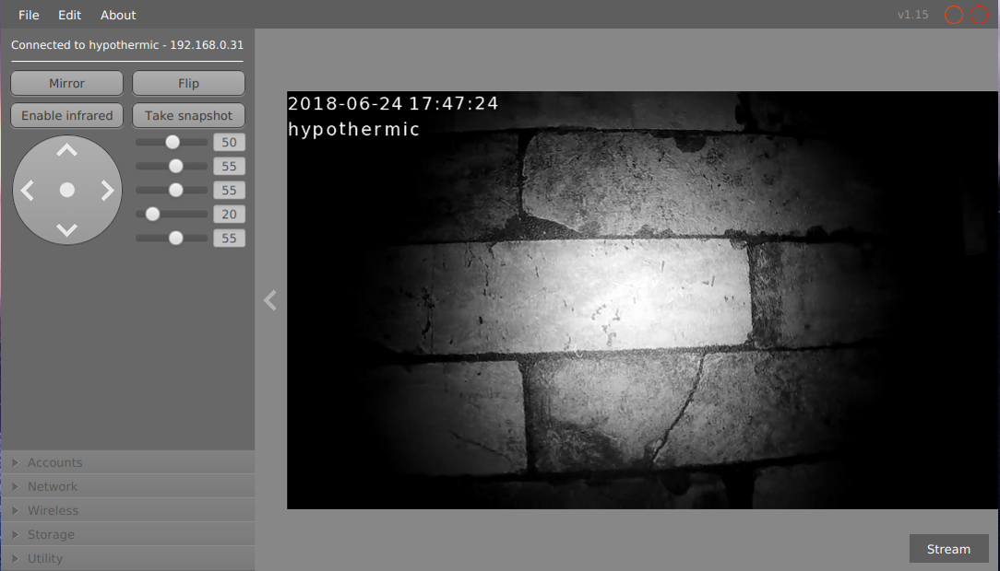

# FoscamViewer
Fast, free and open-source desktop application to view and control your Foscam IP camera.

[Download](https://github.com/hypothermic/FoscamViewer/releases/latest)

## Features
- Most Foscam IP cameras are supported
- Slick and responsive design
- Easy to use: no messing around with advanced settings
- Multiple languages supported (please help translating!)

## Changelog
- v1.17
    - Fixed a bug where the login screen would not disappear
    - Added an optional RTSP port field to the login screen
    - Enable AV logging
- v1.16
    - Added settings accordion
        - Accounts tab finished
        - Networking tab finished (read-only)
    - Added video color sliders
    - Added stream selection menu
    - Fixed language support via args
- v1.15
    - Added camera name change feature
    - Added dynamic UI elements
- v1.14
    - Added drawing feature for the video view
    - Added JavaDoc comments for important classes
    - Fixed indentation which was incorrectly refractored.

- v1.12
    - Added video load animation
    - Added PTZ reset button
    - Added launch.sh
    - Fixed massive RAM leak in the play thread
    - Seperated VideoProcessor into multiple classes
    - Renamed threads for easier profiling

- v1.10
    - Initial release

## Mentions
- FoscamViewer is not affiliated, associated, authorized, endorsed by, or in any way officially connected with Shenzhen Foscam Intelligent Technology Limited, or any of its subsidiaries or its affiliates. The official Foscam website can be found at https://www.foscam.com. The name “Foscam” as well as related names, marks, emblems and images are registered trademarks of Shenzhen Foscam Intelligent Technology Limited.
- The license for this software can be found in the project root ([link](./LICENSE.md))
- FoscamViewer is powered by the powerful FoscamAPI ([link](https://hypothermic.github.io/FoscamAPI/))